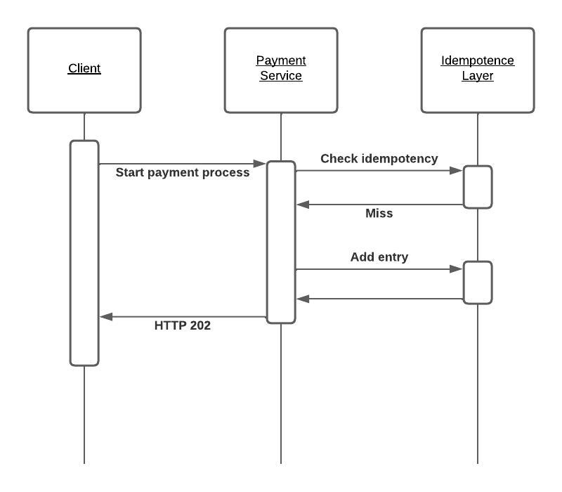
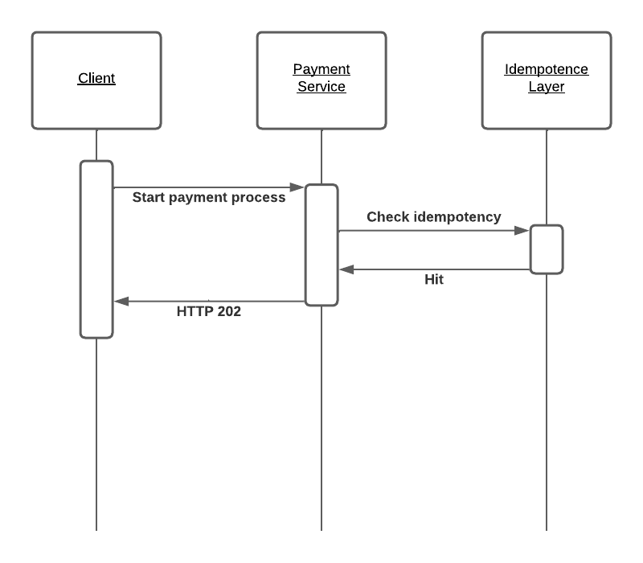
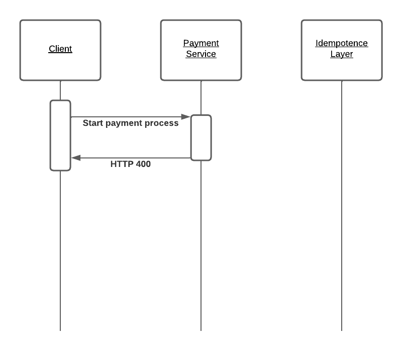

# Project for the Microservices course at the ESGI, Paris, FRANCE

Class: 4AL1  
Students:  
+ Paul BARRIE
+ Paolo MANAOIS
+ Adem MRIZAK

# OpenAPI generated server

Spring Boot Server


## Overview
This server was generated by the [OpenAPI Generator](https://openapi-generator.tech) project.
By using the [OpenAPI-Spec](https://openapis.org), you can easily generate a server stub.
This is an example of building a OpenAPI-enabled server in Java using the SpringBoot framework.

Start your server as a simple java application

You can view the api documentation in swagger-ui by pointing to
http://localhost:8080/

Change default port value in application.properties  


## Launch app  
The app uses Redis as the idempotency layer, the recommended way to launch the app is to use the docker-compose config since it is set up for you.  

If you have never built the app before, run:  
```
mvn clean package && docker-compose build
```

To launch the app, run:  
```
docker-compose up [-d] # ignore the -d option if you directly want to see the output of the api
```

## Sequence diagrams  
In this case, we suppose that the payment process is directly handled by our system. We could imagine, in another scenario, that a 3rd party payment is integrated to the payment service, in which case there would be a 4th system in the diagrams.  


### Payment not processed yet  
  

### Payment already processed  
  

### Bad request due to invalid request payload  
